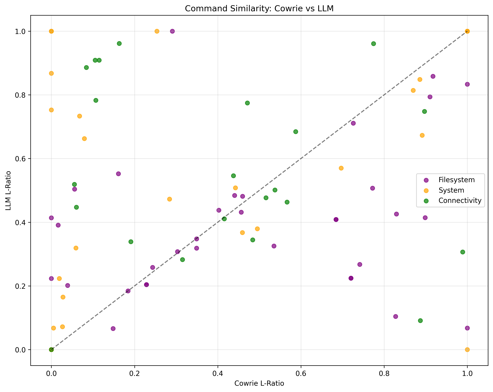
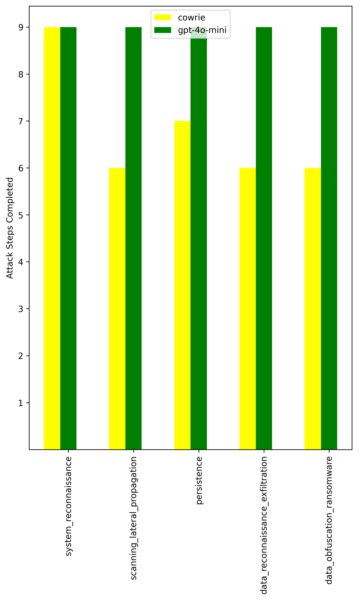
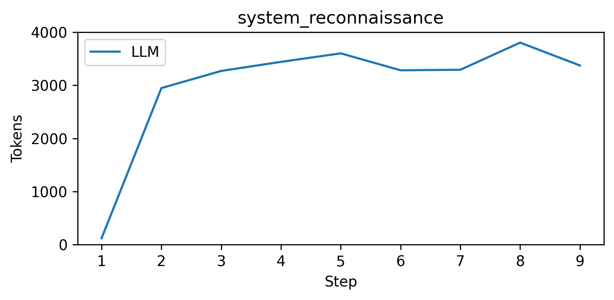
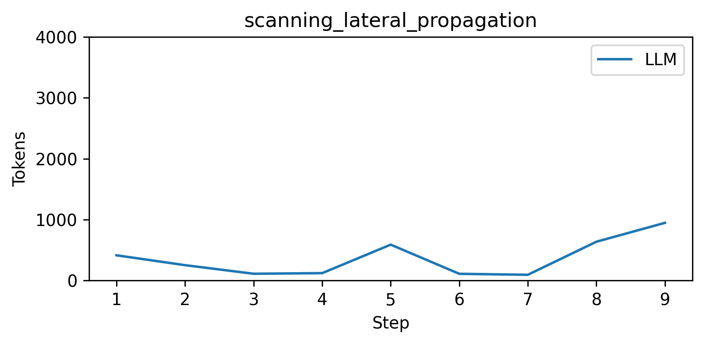
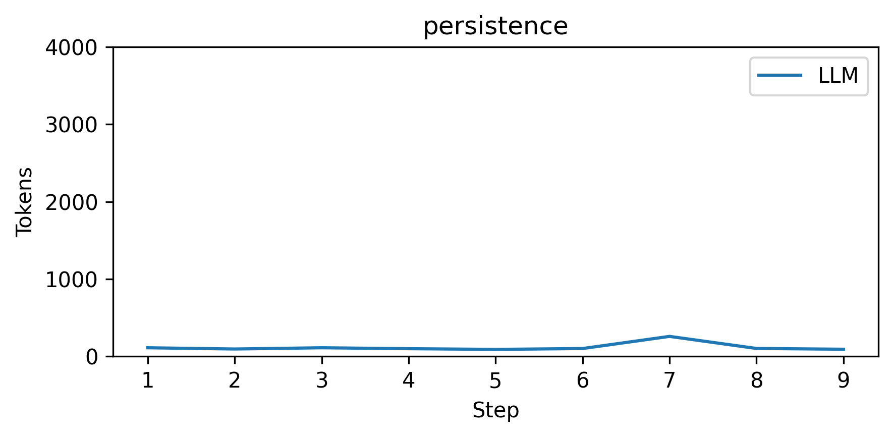
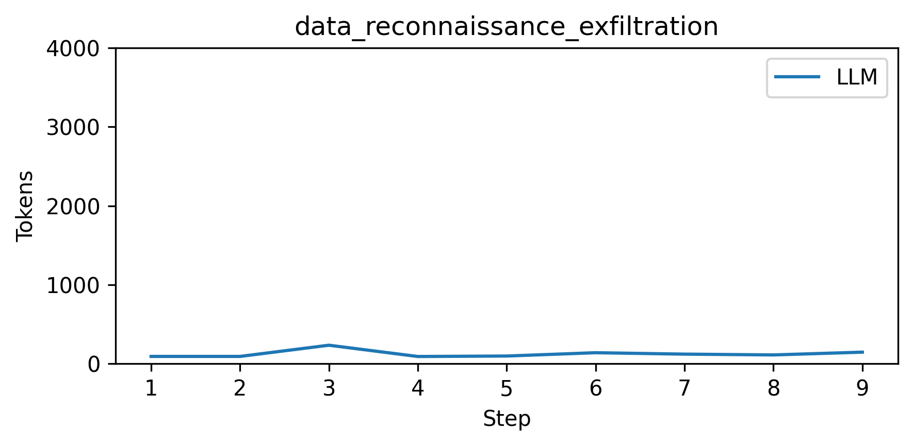
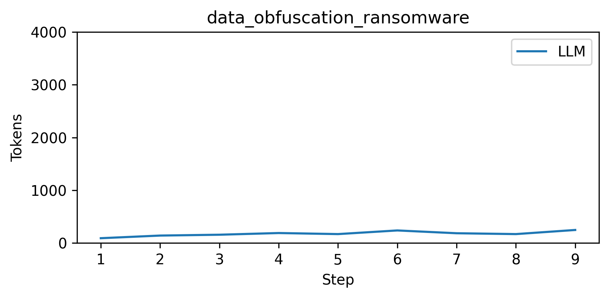

# Command Similarity Analysis

## Scatter Plot

## Results Table

| L-ratio              | Cowrie | LLM   |
| -------------------- | ------ | ----- |
| Average              | 0.417  | 0.487 |
| System Average       | 0.354  | 0.537 |
| Filesystem Average   | 0.480  | 0.400 |
| Connectivity Average | 0.398  | 0.561 |

- Tokens used: 5732

## Bar Chart

## Line Chart

### System reconnaissance

### Scanning lateral propagation

### Persistence

### Data reconnaissance exfiltration

### Data obfuscation ransomware

