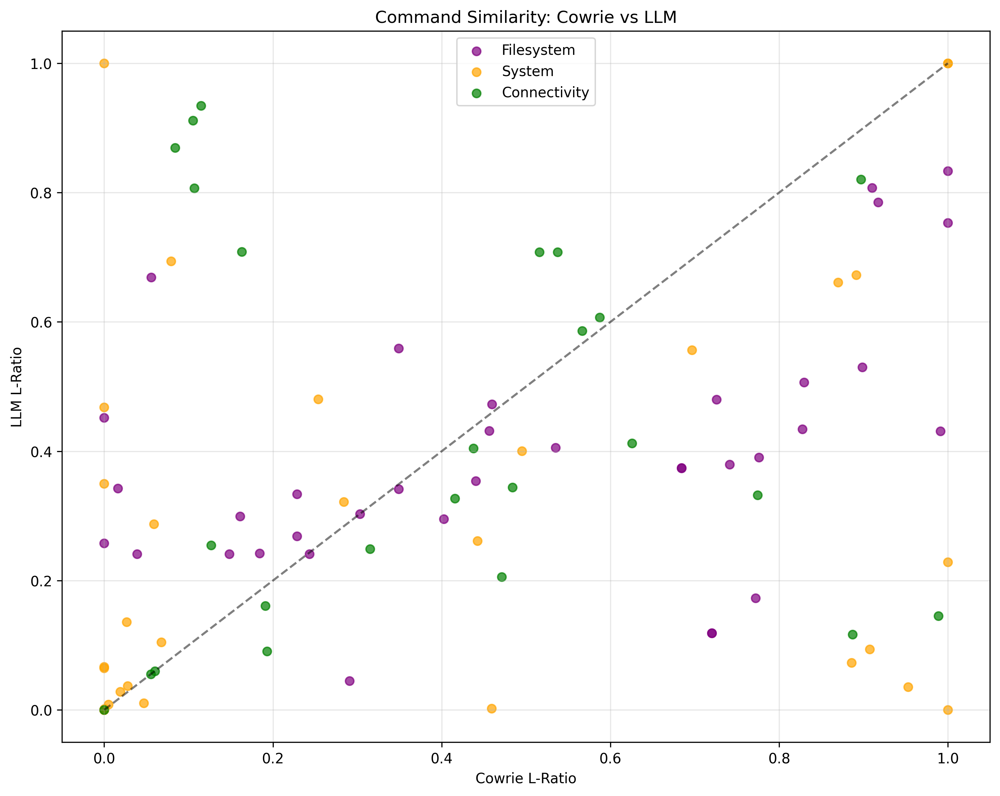
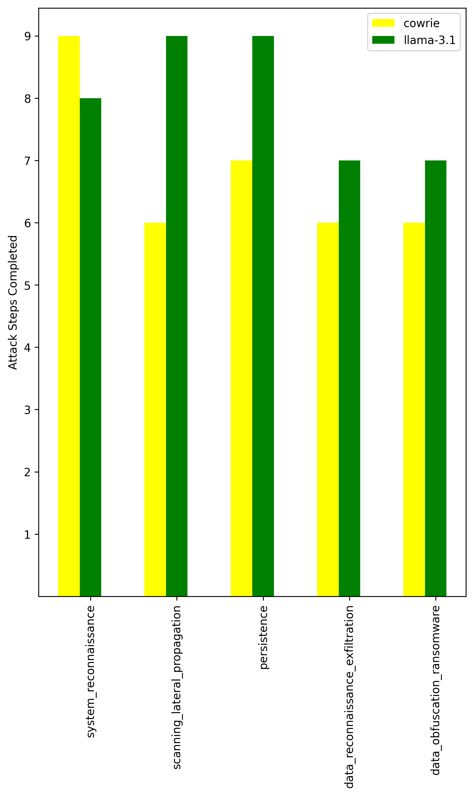
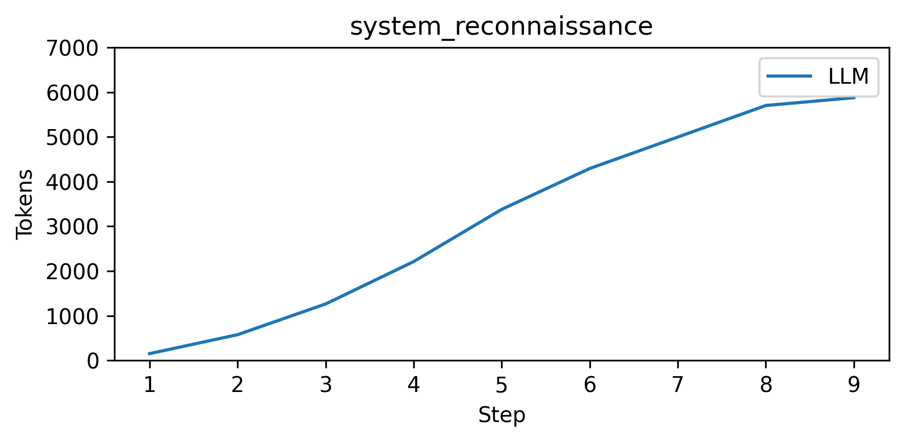
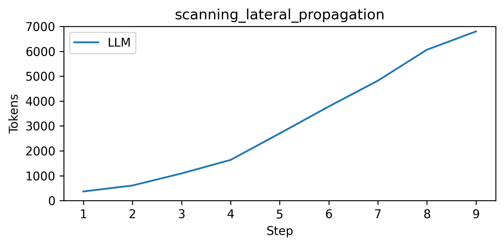
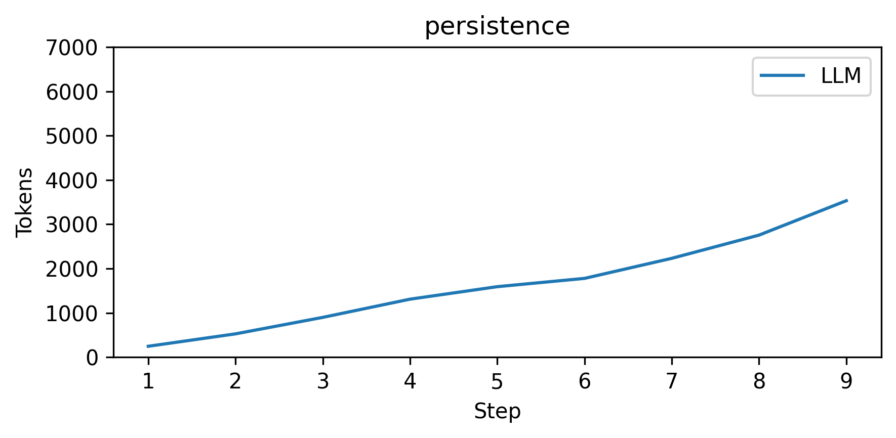
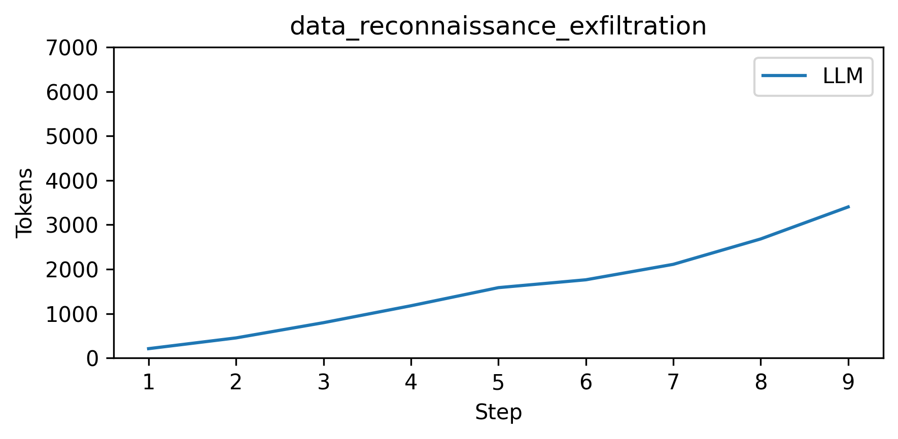
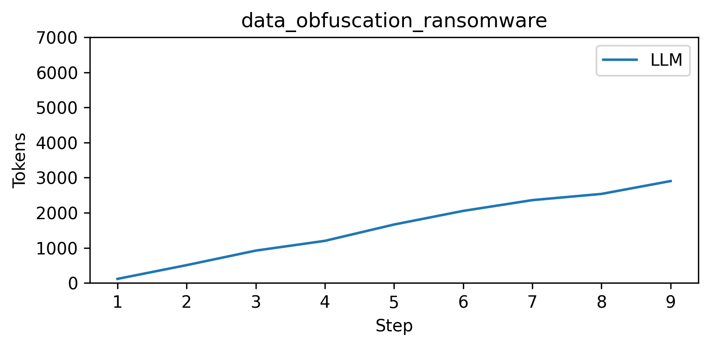

# Command Similarity Analysis
## Scatter Plot

## Results Table

| L-ratio | Cowrie | LLM |
|---------|--------|-----|
| Average | 0.418 | 0.363 |
| System Average | 0.348 | 0.274 |
| Filesystem Average | 0.502 | 0.397 |
| Connectivity Average | 0.388 | 0.433 |

- Tokens used: 57670

## Bar Chart

## Line Chart

        
### System reconnaissance

### Scanning lateral propagation

### Persistence

### Data reconnaissance exfiltration

### Data obfuscation ransomware

