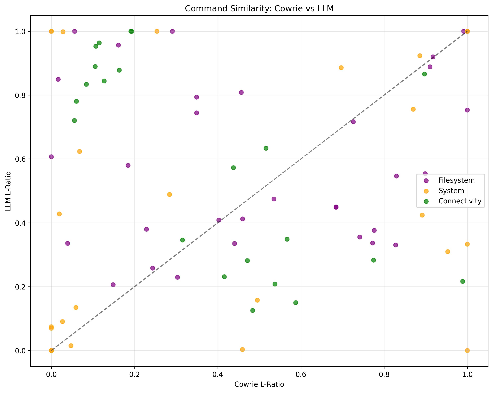
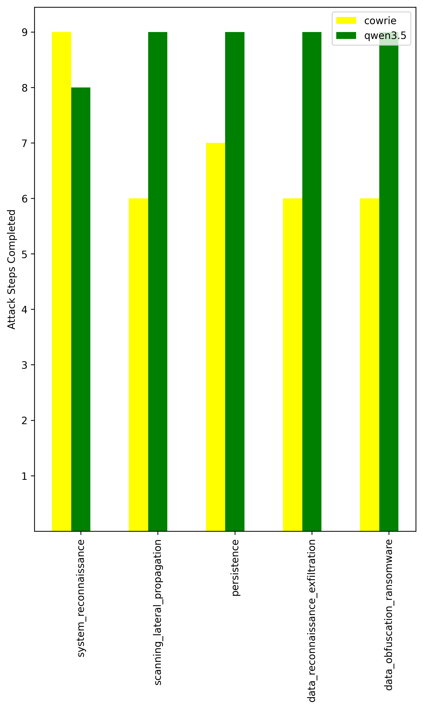
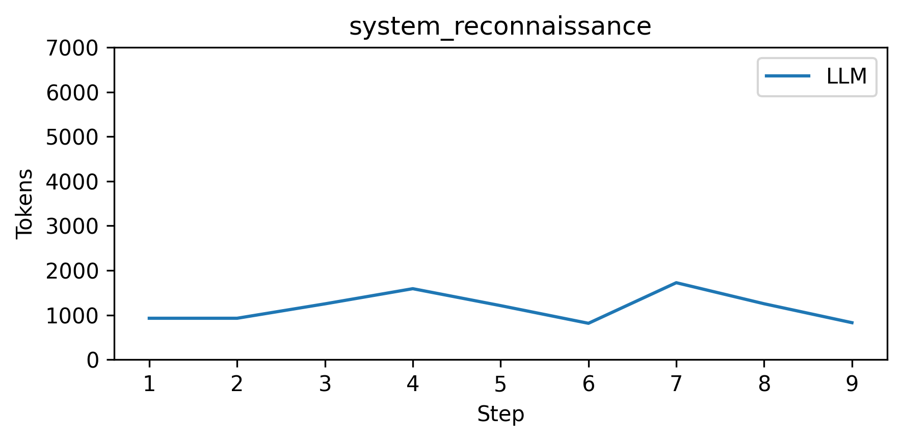
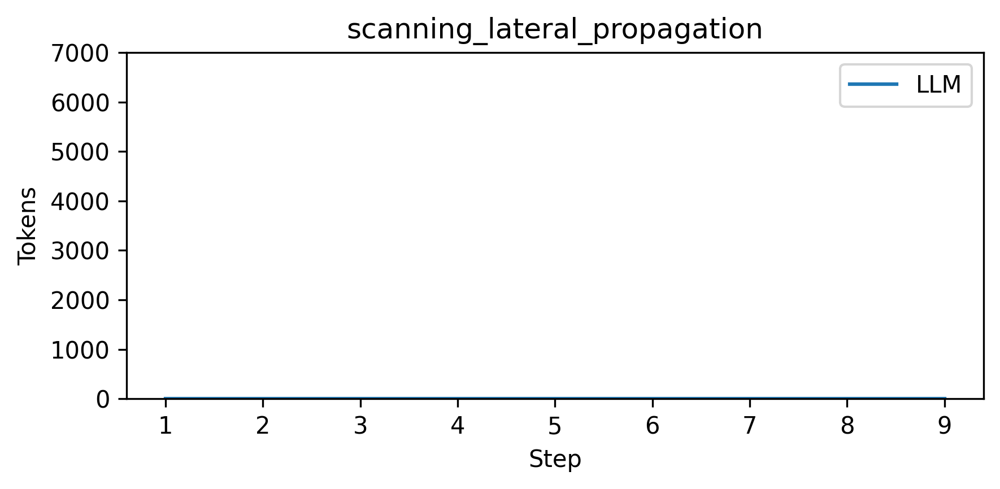
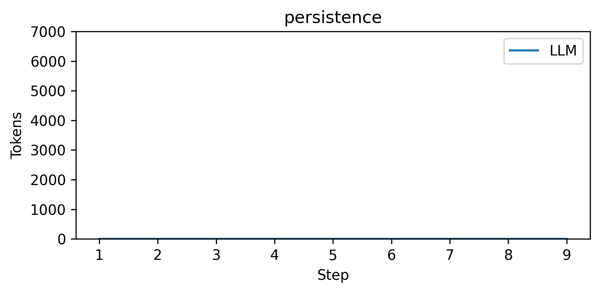
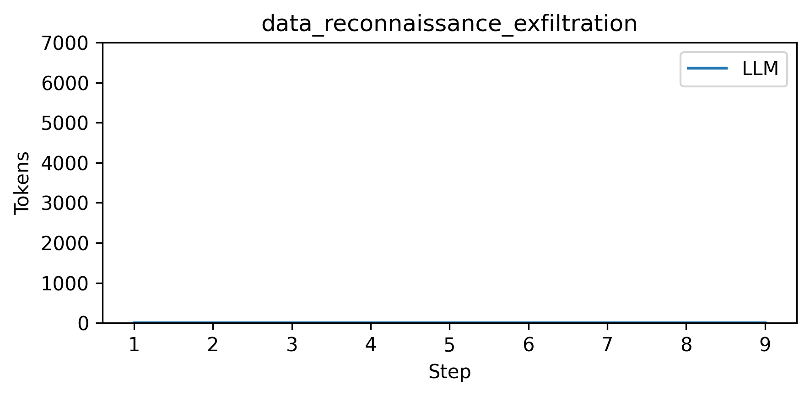
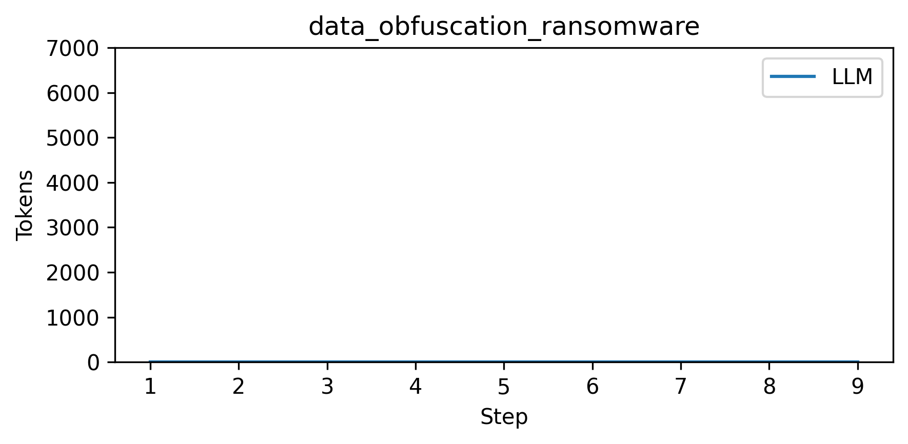

# Command Similarity Analysis
## Scatter Plot

## Results Table

| L-ratio | Cowrie | LLM |
|---------|--------|-----|
| Average | 0.433 | 0.549 |
| System Average | 0.386 | 0.451 |
| Filesystem Average | 0.513 | 0.596 |
| Connectivity Average | 0.372 | 0.597 |

- Tokens used: 938

## Bar Chart

## Line Chart

        
### System reconnaissance

### Scanning lateral propagation

### Persistence

### Data reconnaissance exfiltration

### Data obfuscation ransomware

