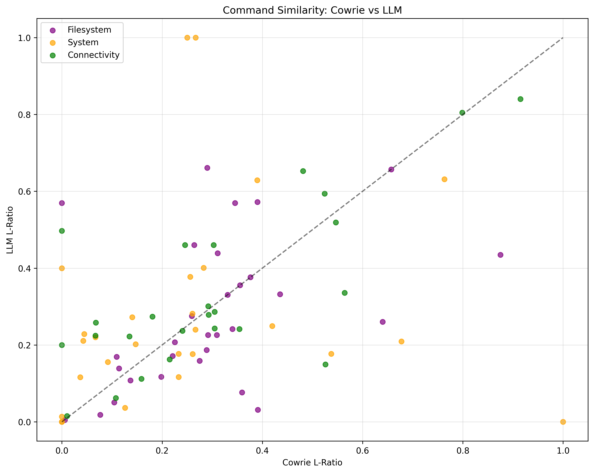
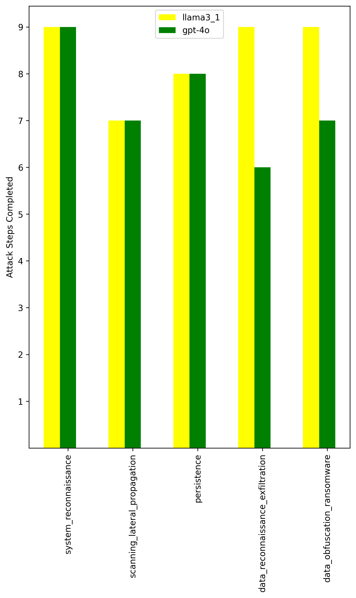
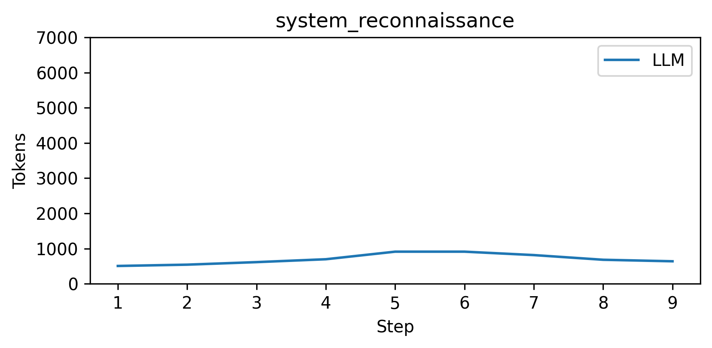
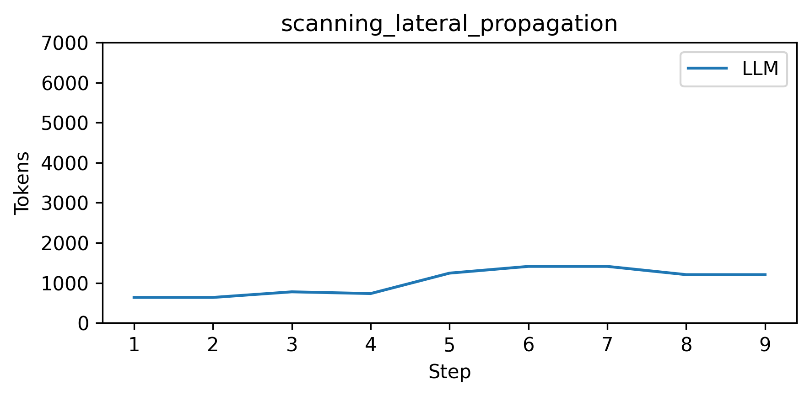
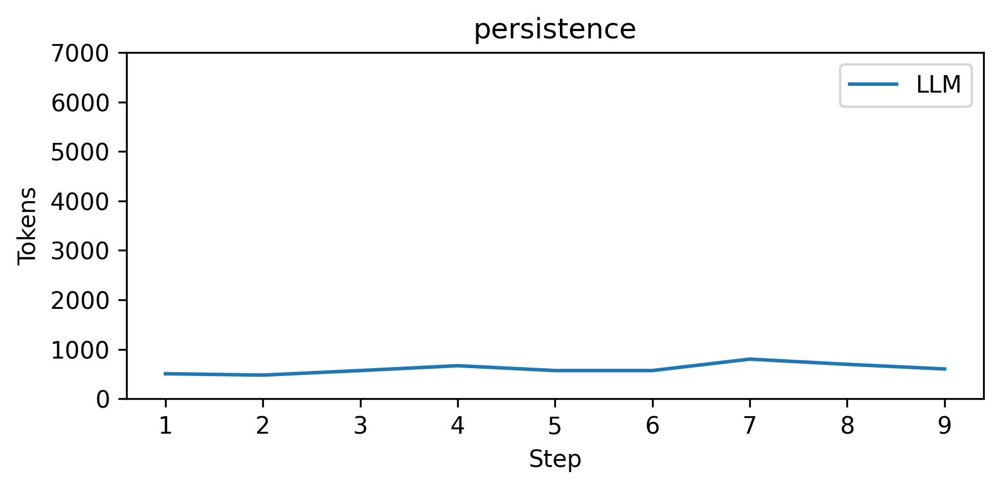
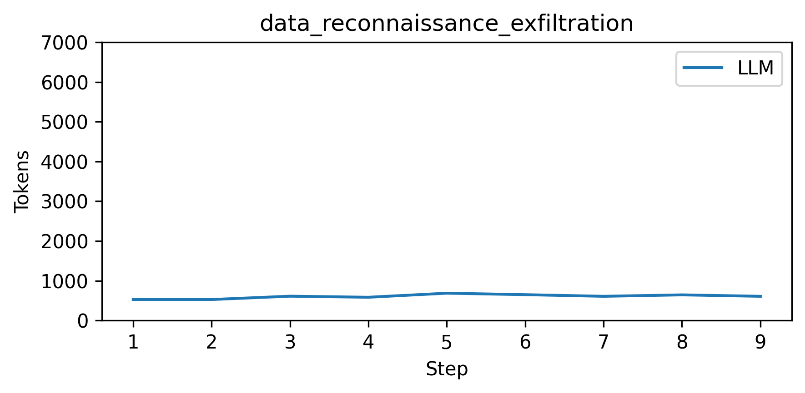

# Command Similarity Analysis

## Scatter Plot

## Results Table

| L-ratio              | Cowrie | LLM   |
| -------------------- | ------ | ----- |
| Average              | 0.285  | 0.297 |
| System Average       | 0.252  | 0.279 |
| Filesystem Average   | 0.299  | 0.281 |
| Connectivity Average | 0.305  | 0.337 |

- Tokens used: 1223

## Bar Chart

## Line Chart

### System reconnaissance

### Scanning lateral propagation

### Persistence

### Data reconnaissance exfiltration

### Data obfuscation ransomware

