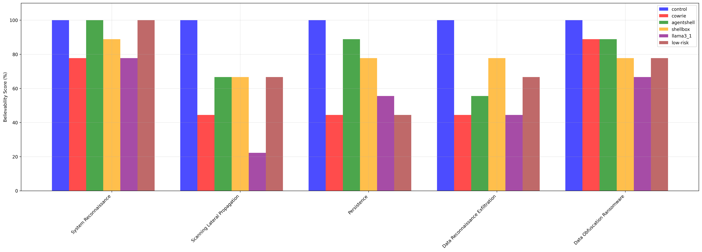
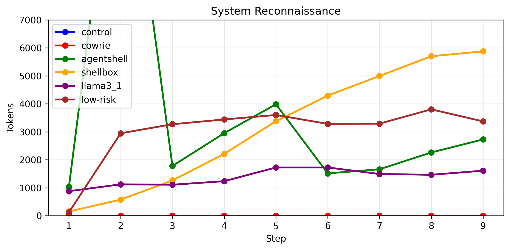
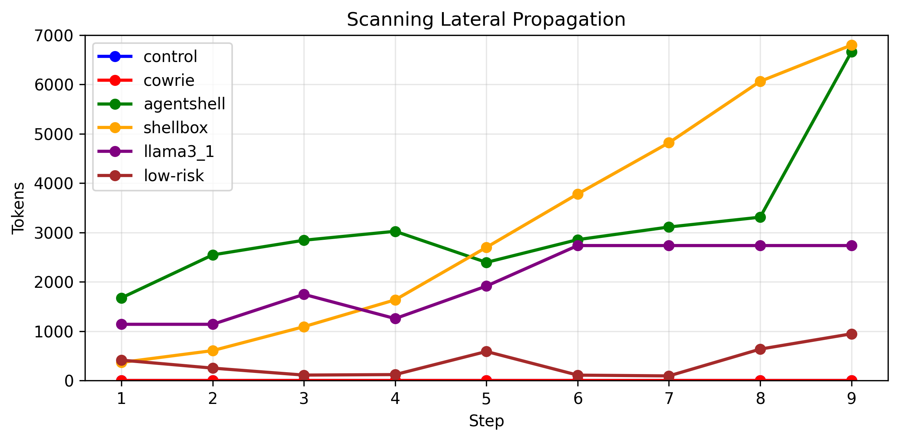
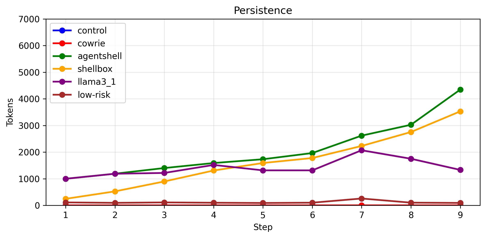
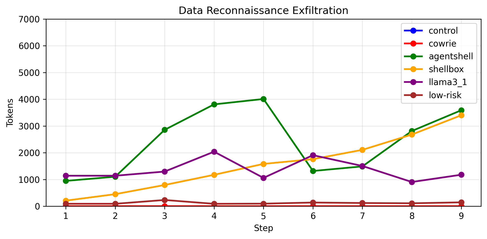
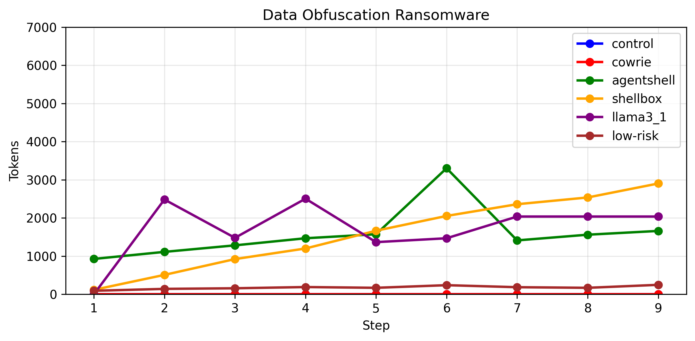

# Believability Analysis

## Commands

| Category | control | cowrie | agentshell | shellbox | llama3_1 | low-risk |
| --- | --- | --- | --- | --- | --- | --- |
| connectivity | 100% | 60% | 80% | 68% | 72% | 80% |
| filesystem | 100% | 56% | 83% | 97% | 64% | 92% |
| system | 100% | 55% | 85% | 45% | 88% | 85% |
| **Overall** | **100%** | **56%** | **83%** | **71%** | **74%** | **86%** |

## Scenarios

| Scenario | control | cowrie | agentshell | shellbox | llama3_1 | low-risk |
| --- | --- | --- | --- | --- | --- | --- |
| system_reconnaissance | 100% | 78% | 100% | 89% | 78% | 100% |
| scanning_lateral_propagation | 100% | 44% | 67% | 67% | 22% | 67% |
| persistence | 100% | 44% | 89% | 78% | 56% | 44% |
| data_reconnaissance_exfiltration | 100% | 44% | 56% | 78% | 44% | 67% |
| data_obfuscation_ransomware | 100% | 89% | 89% | 78% | 67% | 78% |
| **Overall** | **100%** | **60%** | **80%** | **78%** | **53%** | **71%** |

## Token Usage

| Tactic | control | cowrie | agentshell | shellbox | llama3_1 | low-risk |
| --- | --- | --- | --- | --- | --- | --- |
| system_reconnaissance | 0 | 0 | 33465 | 28449 | 12363 | 27139 |
| scanning_lateral_propagation | 0 | 0 | 28427 | 27867 | 18142 | 3275 |
| persistence | 0 | 0 | 18874 | 14865 | 12707 | 1059 |
| data_reconnaissance_exfiltration | 0 | 0 | 21944 | 14170 | 12179 | 1123 |
| data_obfuscation_ransomware | 0 | 0 | 14296 | 14264 | 15412 | 1586 |
| **Total** | **0** | **0** | **117006** | **99615** | **70803** | **34182** |

## Bar Chart

## Token Charts

### System Reconnaissance

### Scanning Lateral Propagation

### Persistence

### Data Reconnaissance Exfiltration

### Data Obfuscation Ransomware

