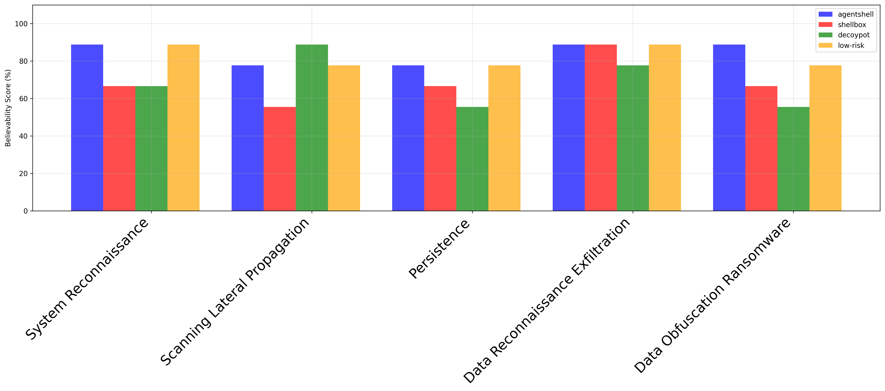
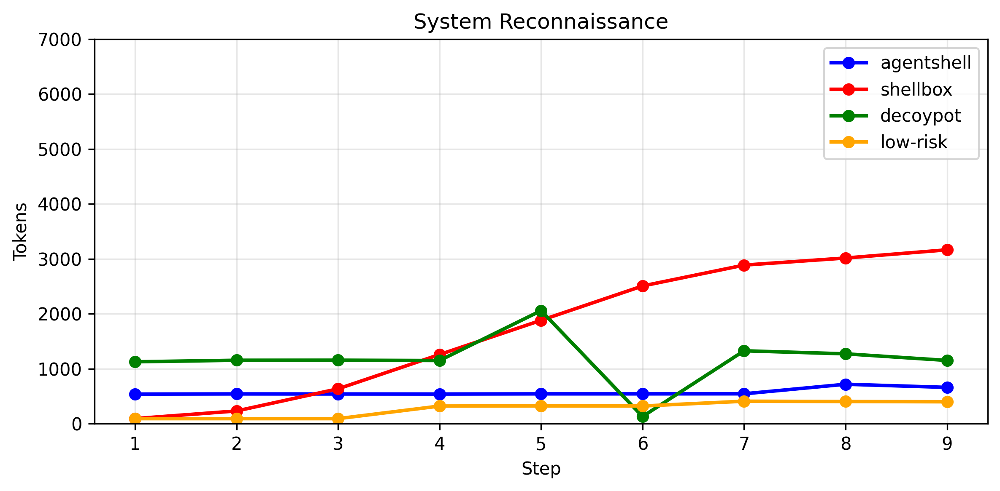
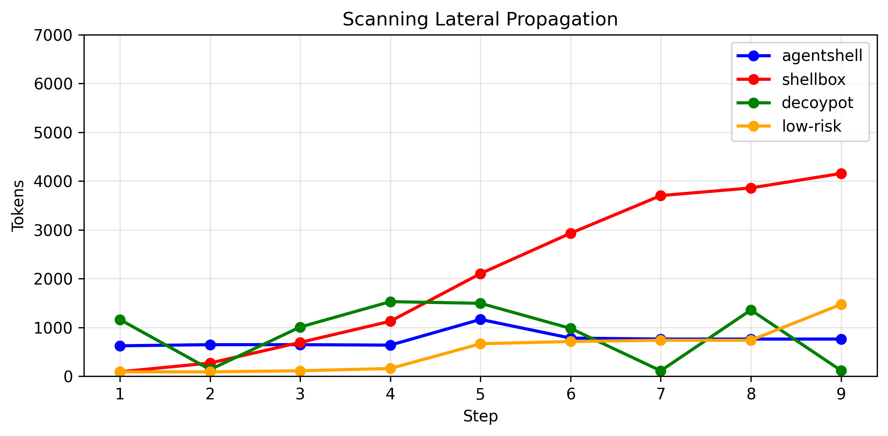
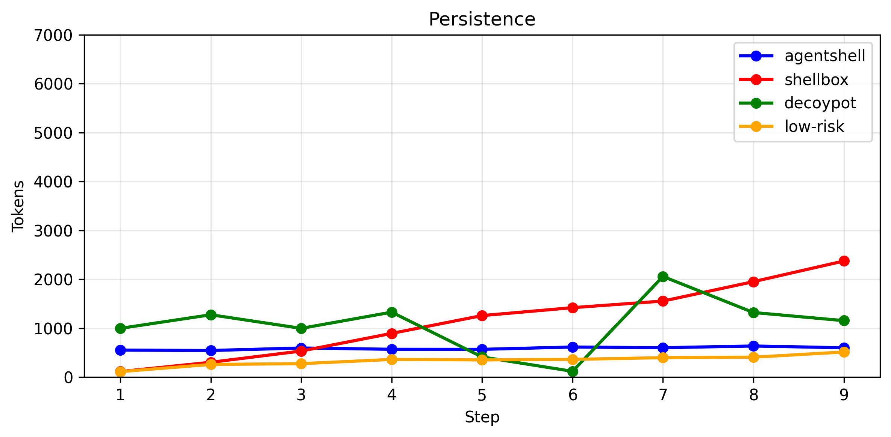
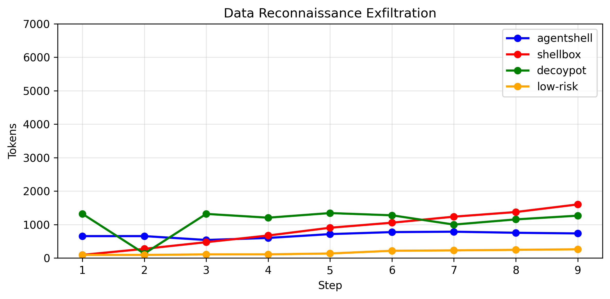
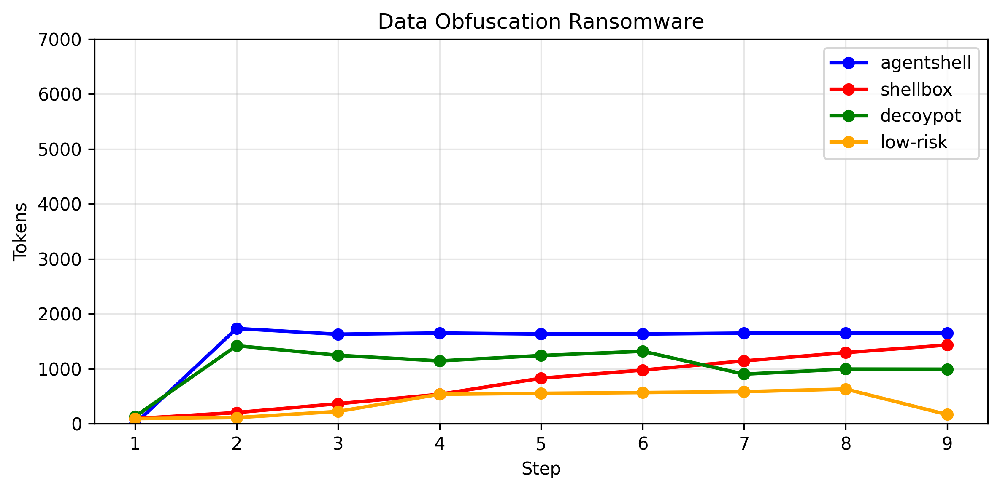

# Believability Analysis

## Commands

| Category | control | cowrie | agentshell | shellbox | decoypot | low-risk |
| --- | --- | --- | --- | --- | --- | --- |
| connectivity | 100% | 76% | 100% | 84% | 84% | 92% |
| filesystem | 100% | 75% | 83% | 97% | 86% | 78% |
| system | 100% | 61% | 97% | 70% | 88% | 85% |
| **Tokens** | **0** | **0** | **63247** | **1390847** | **104641** | **344043** |
| **Overall** | **100%** | **70%** | **93%** | **84%** | **86%** | **84%** |
| **Tokens/1%** | **0.0** | **0.0** | **683.4** | **16549.3** | **1214.4** | **4093.7** |

## Scenarios

| Scenario | agentshell | shellbox | decoypot | low-risk |
| --- | --- | --- | --- | --- |
| system_reconnaissance | 89% | 67% | 67% | 89% |
| scanning_lateral_propagation | 78% | 56% | 89% | 78% |
| persistence | 78% | 67% | 56% | 78% |
| data_reconnaissance_exfiltration | 89% | 89% | 78% | 89% |
| data_obfuscation_ransomware | 89% | 67% | 56% | 78% |
| **Overall** | **84%** | **69%** | **69%** | **82%** |
| **Tokens** | **36682** | **59574** | **47497** | **15226** |
| **Tokens/1%** | **434.4** | **864.8** | **689.5** | **185.2** |

## Bar Chart

## Token usage per step line chart

