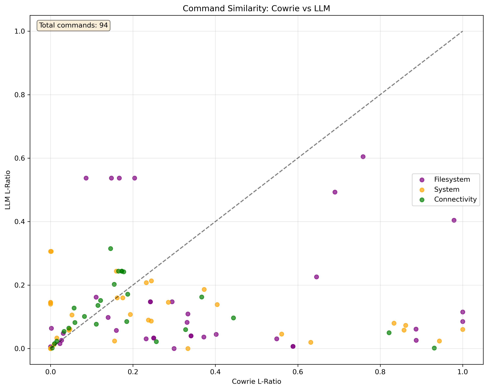

# Command Similarity Analysis

## Scatter Plot

## Results Table

| L-ratio              | Cowrie | LLM   |
| -------------------- | ------ | ----- |
| Average              | 0.296  | 0.127 |
| System Average       | 0.274  | 0.104 |
| Filesystem Average   | 0.378  | 0.155 |
| Connectivity Average | 0.206  | 0.119 |

## Summary

- Total commands analyzed: 94
- System commands: 33
- Filesystem commands: 36
- Connectivity commands: 25
